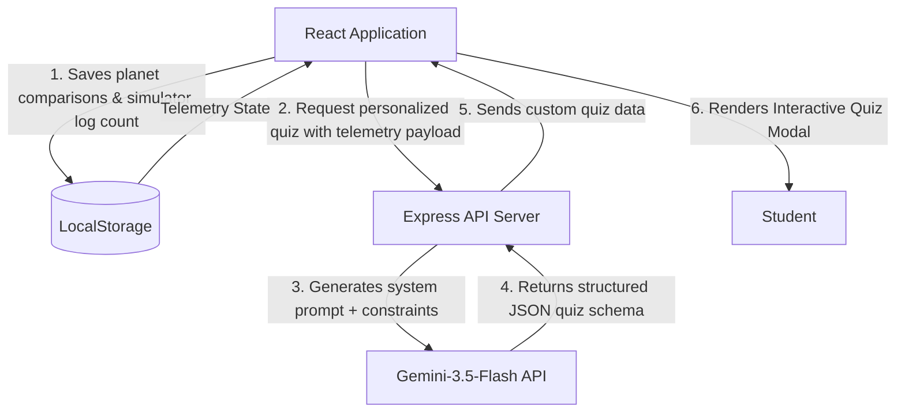

# 🌌 Cosmos Explorers — Interactive Solar System & AI Space Tutor

Cosmos Explorers is a premium, high-fidelity **interactive educational web application** designed for students and space enthusiasts to discover astronomy. By blending real-time simulations, interactive physics comparisons, arcade flight physics, and local telemetry-bound **Gemini AI Space Tutoring**, it delivers an engaging galactic classroom.

## 🚀 Live Demo
**[Visit the Cosmos Explorers Website →](https://daud-hayat-8183.github.io/solar-system-explorer/)**

---

## 📸 Key Features

### 1. Interactive Orbit Canvas Simulation
- **Twinkling Starfields & Nebulas**: Fluid canvas render loop drawing animated Sun flares, custom radial atmospheric gradients, and orbiting moons (like Earth's Moon).
- **Orbit Warp Controls**: Modify the simulation speed on-the-fly (`Pause`, `1x`, `5x`, `15x` speed warps).
- **HUD Telemetry overlays**: Cursor-tracking sensor reading real-time coordinate positions, radar angles in radians, distance orbits in millions of kilometers, and relative velocities.
- **Toggleable Visuals**: Easily hide orbit trail paths or adjust zoom scaling levels (`70%`, `100%`, `120%`) to display outer worlds.

### 2. Spectroscope & Core Explorer
- **Detailed Spectral Scans**: Discover the composition and history of 9 celestial bodies (the Sun, Mercury, Venus, Earth, Mars, Jupiter, Saturn, Uranus, Neptune, Moon, Pluto).
- **Inner Core Stratification**: High-fidelity layered breakdowns detailing volumic percentages (metallic core, silicate mantle, fusion current shell) mapped with glowing progress bars.
- **Trace Atmosphere telemetry**: Inspect gas structures (Hydrogen, Helium, Argon, Carbon-Dioxide) and read flight logs.

### 3. Comparison Laboratory
- **Side-by-Side Visual Scale**: Computes size ratios relative to the solar system's maximum diameter, rendering relative spheres side-by-side.
- **Differential Spec Meters**: Graphical comparison progress bars mapping relative diameter widths and gravitational pull rates ($m/s^2$).
- **Telemetry Delta Tables**: Side-by-side data cards comparing moon count demographics and average temperature ranges.

### 4. Lander VR Flight Simulator
- **Arcade Thruster Physics**: Gravity-bound flight simulator featuring propellant fuel limits, vertical descent speeds, lateral velocity adjustments, and altitude meters.
- **On-Screen Mobile HUD**: Renders real-time fuel, altitude, and descent speed on top of the canvas, offering mobile/tablet players instant telemetry feedback.
- **Planetary Gravity Environments**: Land on the `Moon` (low gravity), `Mars` (standard gravity), or inside the storm clouds of `Jupiter` (extreme gravity).
- **Neon Landing Basin**: Safely align horizontal velocity (under 3 m/s) and vertical descent speed (under 5 m/s) to avoid fracturing the lander hull.

### 5. Dual-Engine Quiz Zone & Gemini AI Tutor
- **Preset Academy Calibrations**: Standard multiple-choice tests evaluating astronomy core concepts with verified explanation panels.
- **Gemini-3.5-Flash Powered Neural Tutor**: Personalized calibration wizard that binds your browser local state. It looks up your planet comparison history and successful flight simulator missions, using Gemini to generate a tailored 5-question test!
- **AI Academic Feedback Report**: Dynamically analyzes quiz answers, constructs constructive critiques about mistakes, and writes study guides in polished Markdown.
- **Offline Client-Side Fallback**: Auto-shuffles predefined quiz templates and generates mock study reports locally in the browser if the Gemini backend connection times out.

### 6. Gamification Progress Dashboard
- **XP Progression & Local Persistence**: Saves your cumulative score, badges, and completed mission counts across sessions using `localStorage`.
- **Achievement Badges**: Earn badges (e.g., *Saturn Ring-Master*, *Solar Flare Cadet*, *Nebula Admiral*, *Academic Innovator*) displayed on your profile.

---

## 📐 System Architecture

Cosmos Explorers utilizes a local state telemetry bridge. When you calibrate the AI Tutor, the client bundles your local session logs and comparisons, sending them to the Node Express server. The server packages this state inside system instructions to the Gemini API, returning a custom science quiz:



---

## 🛠️ Tech Stack

- **Frontend Core**: [React 19](https://react.dev/), [TypeScript](https://www.typescriptlang.org/), [HTML5 Canvas](https://developer.mozilla.org/en-US/docs/Web/API/Canvas_API)
- **Styling & Theme**: [TailwindCSS 4](https://tailwindcss.com/) (modern CSS variable configuration via `@theme`)
- **Backend Architecture**: [Node.js](https://nodejs.org/) & [Express](https://expressjs.com/) (serving custom API pipelines & Vite dev middleware)
- **Generative AI Integration**: [@google/genai SDK](https://www.npmjs.com/package/@google/genai)
- **State Management & Physics**: Web Storage API (`localStorage`), Web Audio API (synthesized quiz sound effects)

---

## 📦 Getting Started (Local Development)

### 📋 Prerequisites
1. Install [Node.js](https://nodejs.org/) (v18+ recommended).
2. Set up your **Gemini API Key**. Get one for free from Google AI Studio.

### 🔧 Setup Steps

1. **Clone the Repository**
   ```bash
   git clone https://github.com/daud-hayat-8183/solar-system-explorer.git
   cd solar-system-explorer
   ```

2. **Configure Environment Variables**
   Create a `.env` file in the root folder and add your API key:
   ```env
   GEMINI_API_KEY=your_gemini_api_key_here
   ```

3. **Install Dependencies**
   ```bash
   npm install
   ```

4. **Run Development Server**
   ```bash
   npm run dev
   ```
   Open `http://localhost:3000` in your browser. The Express Node server will run and integrate the Vite dev middleware automatically.

5. **Type Checking & Production Build**
   ```bash
   # Run TypeScript compilation check
   npm run lint
   
   # Build static production bundle
   npm run build
   ```

---

## 🌐 Deployment & CI/CD
This project features automated GitOps deployments. Push updates to the `main` branch to trigger a GitHub Actions workflow, compiling and publishing the static build to **GitHub Pages**.

---

## 📄 License
Licensed under the [Apache-2.0 License](LICENSE).
